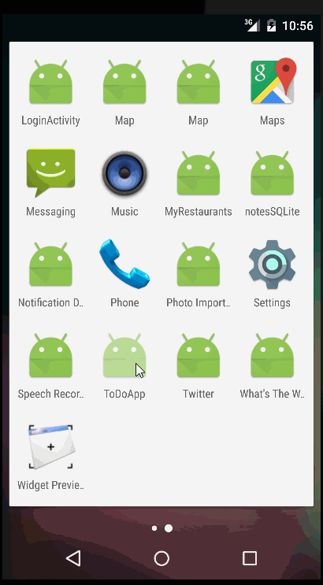

# Pre-work - ToDoApp

ToDoApp is an android app that allows building a todo list and basic todo items management functionality including adding new items, editing and deleting an existing item.

Submitted by: Zekun Wang

Time spent: 10 hours spent in total

The following **required** functionality is completed:

* [x] User can **successfully add and remove items** from the todo list
* [x] User can **tap a todo item in the list and bring up an edit screen for the todo item** and then have any changes to the text reflected in the todo list.
* [x] User can **persist todo items** and retrieve them properly on app restart

The following **optional** features are implemented:

* [x] Persist the todo items [into SQLite](http://guides.codepath.com/android/Persisting-Data-to-the-Device#sqlite) instead of a text file
* [x] Improve style of the todo items in the list [using a custom adapter](http://guides.codepath.com/android/Using-an-ArrayAdapter-with-ListView)
* [x] Add support for completion due dates for todo items (and display within listview item)
* [ ] Use a [DialogFragment](http://guides.codepath.com/android/Using-DialogFragment) instead of new Activity for editing items
* [x] Add support for selecting the priority of each todo item (and display in listview item)
* [x] Tweak the style improving the UI / UX, play with colors, images or backgrounds

The following **additional** features are implemented:
* [x] Add content input for detailed info or the TODO item
* [x] Improve deletion with alert
* [x] Add sorting feature
* [x] Add support for mark of completion
* [x] Add support for quick enable/disable date and time picker

Here's a walkthrough of implemented user stories:

GIF created with [LiceCap](http://www.cockos.com/licecap/).

Challenges encountered while building the app:

1. Manipulate ListView and Adapter successfully.
2. Do content switch and pass data correctly.
3. Support date and time picker
